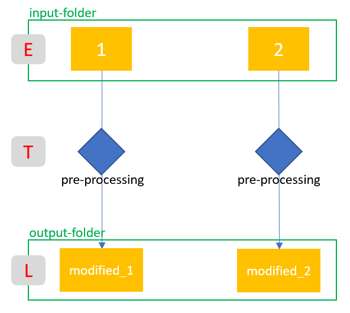
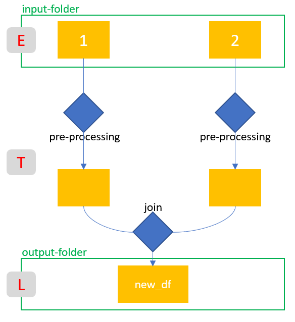
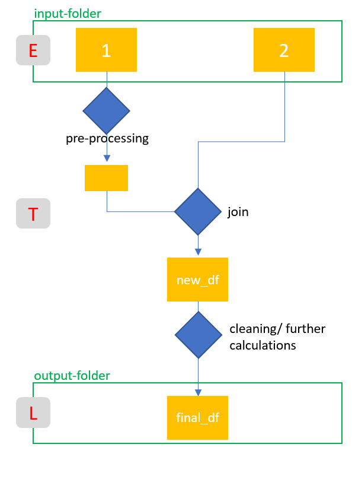
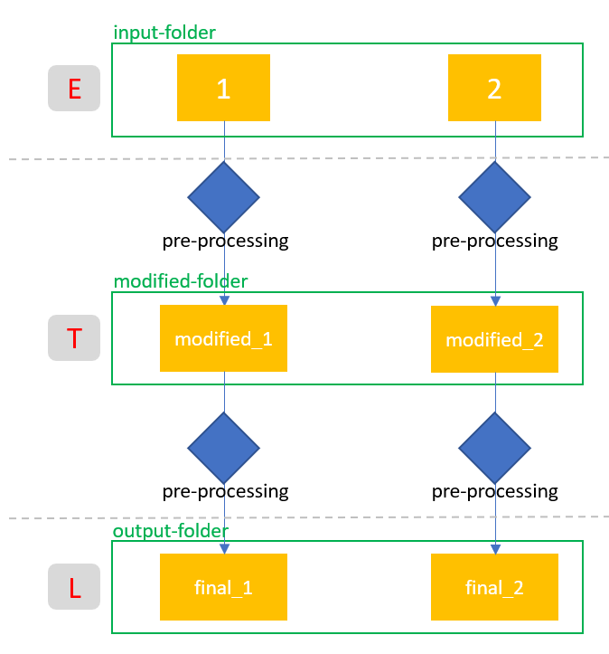
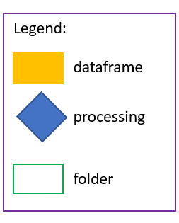

# ETL-Pipelines with Python


A rule of thumb says that a data scientist spends 80% of his time on data preparation. The same amount of code is generated at this point. If you are working on a customer project that is only interested in the results, the notebook in which you are working, for example, is quickly overcrowded with syntax that only refers to the preparation of the data. For such a case it is a good idea to write an ETL-script. 


## Table of Contents
1. [Introduction](#introduction)
2. [Software Requirements](#software_requirements)
3. [Folder Structure](#folder_structure)
4. [Getting Started](#getting_started)
5. [Overview of the ETL steps](#overview)
    1. [Simple_Pipeline](#simple_pipeline)
    2. [Pipeline_with_join](#pipeline_with_join)
    3. [Pipeline_with_join2](#pipeline_with_join2)
    4. [Pipeline_with_intermediate_storage](#pipeline_with_intermediate_storage)  
6. [Link to the Publications](#link_publications)    
7. [Authors](#authors)
8. [Motivation](#motivation)


<a name="introduction"></a>

## Introduction

In this repository I have stored several variants of ETL pipelines. They serve as a template and can be extended as desired.

<a name="software_requirements"></a>

## Software Requirements

Required libraries:

+ Python 3.x
+ Numpy
+ Pandas


Please run ```pip install -r requirements.txt```


<a name="folder_structure"></a>

## Folder Structure

```
├───1_Simple_Pipeline
│   ├───data
│   │   ├───input
│   │   └───output
│   └───notebooks
├───2_Pipeline_with_join
│   ├───data
│   │   ├───input
│   │   └───output
│   └───notebooks
├───3_Pipeline_with_join2
│   ├───data
│   │   ├───input
│   │   └───output
│   └───notebooks
└───4_Pipeline_with_intermediate_storage
    ├───data
    │   ├───input
    │   ├───input_modified
    │   └───output
    └───notebooks
```

I have built 4 different ETL variants. 

+ 1_Simple_Pipeline
+ 2_Pipeline_with_join
+ 3_Pipeline_with_join2
+ 4_Pipeline_with_intermediate_storage

The basic structure of all four variants is the same. 
Each variant includes a data folder and a folder for the notebooks.
Inside the data folder I create another folder called 'input'. This is where I put my original /raw files.
The output-folder shown above are automatically created by the ETL.
With the help of the notebooks I developed the .py file. The etl_pipeline.py files are always stored in the data-folder.


<a name="getting_started"></a>

## Getting Started

1. Make sure Python 3 is installed.
2. Clone the repository and navigate to the respective project's root directory in the terminal
3.  ETL execution
    1. from jupyter notebook: The ETL file can be executed directly from a Jupyter notebook. A sample procedure can be found under notebooks/Test_Notebook.
    2. from command line: Use a command line of your choice and navigate to the respective project's root directory. Run the following commands:
        1. ```cd "path/to/root directory"```
        2. ```python etl_pipeline.py"```


<a name="overview"></a>

## Overview of the ETL steps

In the following I show the individual steps that are used in the respective ETL variants:

<a name="simple_pipeline"></a>

### Simple_Pipeline



--------------------------------------------------------------------------------------------------------

<a name="pipeline_with_join"></a>

### Pipeline_with_join



--------------------------------------------------------------------------------------------------------

<a name="pipeline_with_join2"></a>

### Pipeline_with_join2



--------------------------------------------------------------------------------------------------------

<a name="pipeline_with_intermediate_storage"></a>

### Pipeline_with_intermediate_storage



Corresponding legend:


 

<a name="link_publications"></a>

## Link to the Publications

For each of the listed ETL variants I have written a separate post. In it I have explained my approach and usage again in detail.

+ [Simple_Pipeline](https://michael-fuchs-python.netlify.app/2020/11/24/etl-simple-pipeline/)
+ [Pipeline_with_join](https://michael-fuchs-python.netlify.app/2020/11/25/etl-pipeline-with-join/)
+ [Pipeline_with_join2](https://michael-fuchs-python.netlify.app/2020/11/26/etl-pipeline-with-join2/)
+ [Pipeline_with_intermediate_storage](https://michael-fuchs-python.netlify.app/2020/11/27/etl-pipeline-with-intermediate-storage/)


<a name="authors"></a>

## Authors

+ [Michael Fuchs](https://github.com/MFuchs1989)

<a name="motivation"></a>

## Motivation: 

I've been blogging since 2018 on my homepages about all sorts of topics related to Machine Learning, Data Analytics, Data Science and much more.
You are welcome to visit them:

+ [Python Blog](https://michael-fuchs-python.netlify.app/)
+ [R Blog](https://michael-fuchs.netlify.app/)

I also publish individual interesting sections from my publications in separate repositories to make their access even easier. 
